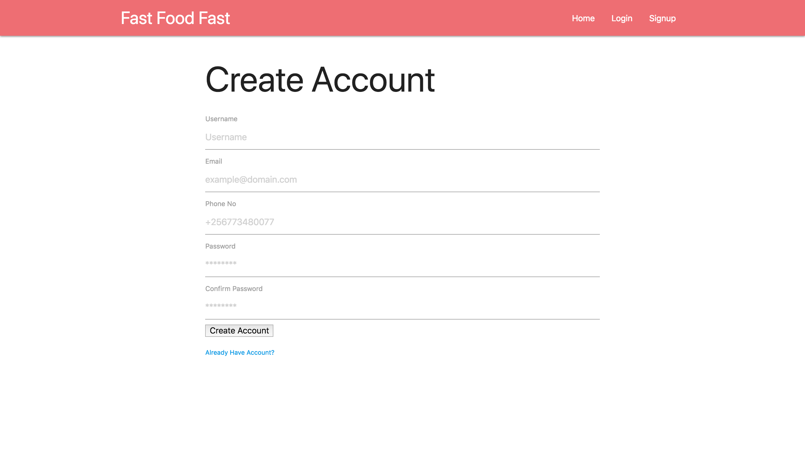

# fast-food-fast-8.1

Fast-Food-Fast is a food delivery service app for a restaurant.

[](https://codeclimate.com/github/Opio-Emmanuel-Omona/fast-food-fast-8.1/maintainability)
[](https://circleci.com/gh/Opio-Emmanuel-Omona/fast-food-fast-8.1)
[](https://codeclimate.com/github/Opio-Emmanuel-Omona/fast-food-fast-8.1/test_coverage)


## Application URL

https://fast-food-fast-staging.herokuapp.com/

## Pivotal Tracker Board
https://www.pivotaltracker.com/n/projects/2316226

## SETUP

### Requirements
```
- Node installed
```

### Installation and Setup

Run the following in your command line
```
- git clone https://github.com/Opio-Emmanuel-Omona/fast-food-fast-8.1.git
- cd fast-food-fast-8.1
- git checkout develop
- npm install
- npm run build
- npm start
```

### Testing
Navigate through the application.

